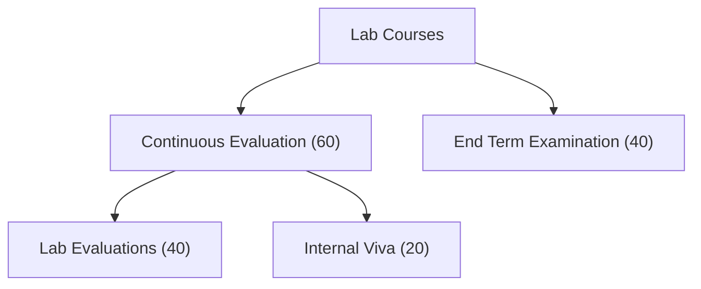

```mermaid
flowchart TB
    A["Lab Courses"]
    B["Continuous Evaluation (60)"]
    C["Lab Evaluations (40)" ]
    D["Internal Viva (20)"]
    E["End Term Examination (40)"]

A --> B
B --> C
B --> D
A --> E
```