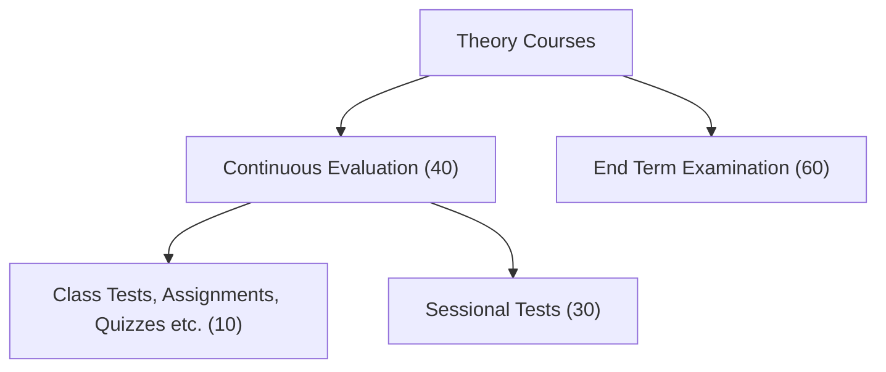

```mermaid
flowchart TB
    A["Theory Courses"]
    B["Continuous Evaluation (40)"]
    C["Class Tests, Assignments, Quizzes etc. (10)"]
    D["Sessional Tests (30)"]
    E["End Term Examination (60)"]

A --> B
B --> C
B --> D
A --> E
```